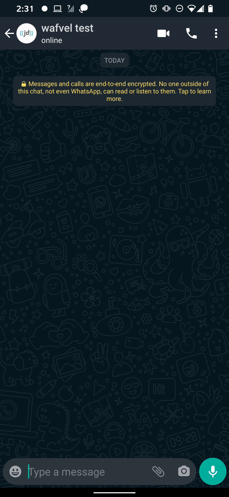

# Whatsapp Campaign Chat Sender - WACCS

___

#### This NodeJS script was a part of wafvel.com 
- a REST API for Whatsapp Notification
- a webhook for all your whatsapp message
- a multi-chat multi-operator in one whatsapp number. (wip)
___

##### What this script does :
- Marketing tool to help you send a campaigns for your Customers using Whatsapp.
- Randomly create a batch list of random user, then send a message to each of them on random waiting time per batch.
- Each batch will have another waiting time.
- Each Number will be checked by this script, if its a whatsapp number or not.
- When some user chat back or replying your campaign messages, this script will automatically reply back with template message
- When some user chat back or replying your campaign messages, this script will automatically forward to another number or your primary number.
- At the end of the batch, it will create a list of result which was a whatsapp number.

##### Screenshot

##### How to run :

1. Clone this repo
2. Change your variable in `.env`
3. Add your recipient list in phonelist.csv in `name, phone` format.
4. run `npm install`
5. run `npm start`

##### Terms and License :
- This script was under MIT License.
- Batch chat will trigger whatsapp ban system, and mostly this will ban your number for spamming, use it with your own risk.
- If you have another trick for improve this, just do a pull request.

##### Thanks to :
- [Venom Bot](https://github.com/orkestral/venom/)